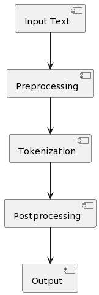

# Tokenizer

A simple tokenizer for natural language processing.

## NLP Workflow

1. **Input**: This is the text that needs to be tokenized. It could be a sentence, a paragraph, or an entire document.
2. **Pre-processing**: This step involves cleaning up the input text by removing any unnecessary characters, normalizing the
text to a standard format, and applying any language-specific rules that are needed.
3. **Tokenization**: This is the main step of the tokenizer, where the input text is broken down into individual tokens. A
token can be a word, a punctuation mark, or any other meaningful unit of text. This step usually involves some complex
rules for identifying word boundaries, handling contractions, and dealing with irregular spellings.
4. **Post-processing**: This step involves any additional processing that needs to be done on the tokens after they've been
generated. This might include filtering out certain types of tokens, merging adjacent tokens together, or applying
additional language-specific rules.
5. **Output**: This is the final result of the tokenizer, which is a list of tokens that can be used for further processing or
analysis.

## Functionality

The Python Tokenizer supports the following functionalities:

- Tokenization of input text using the space character as a delimiter.
- Support for input text in both string and file formats.
- Generation of output in a list of tokens.

## Usage
- Using the tokenizer
```python
tokenize("This is a sentence")
```
```
[<SOS>, this, is, a, sentence, <EOS>]
```
- Using sentence/document format:
```python
doc = Document("This is a sentence. This is another sentence.")

for sentence in doc:
    print(sentence, sentence.tokens)
```
```
This is a sentence. [<SOS>, This, is, a, sentence, ., <EOS>]
This is another sentence. [<SOS>, This, is, another, sentence, ., <EOS>]
```

# Credits
<https://github.com/Sirsirious/NLPTools>
<https://medium.com/analytics-vidhya/tokenization-building-a-tokenizer-and-a-sentencizer-c19a00393c19>
